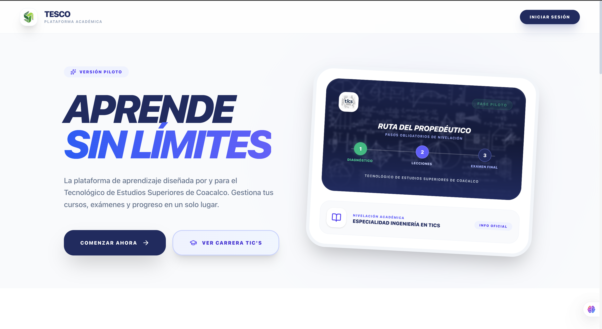
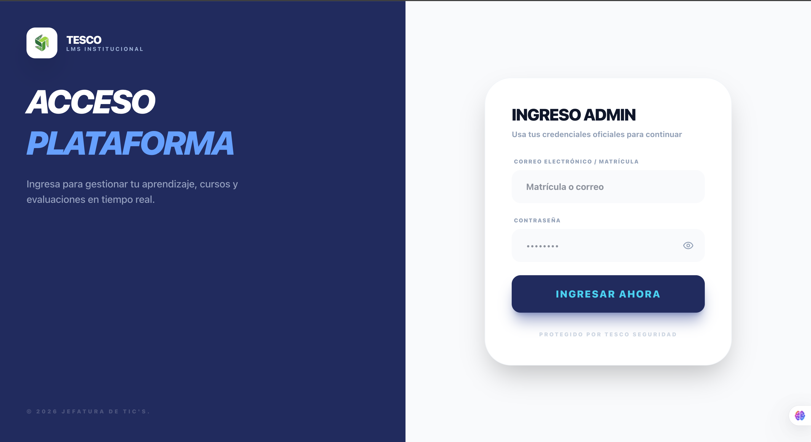
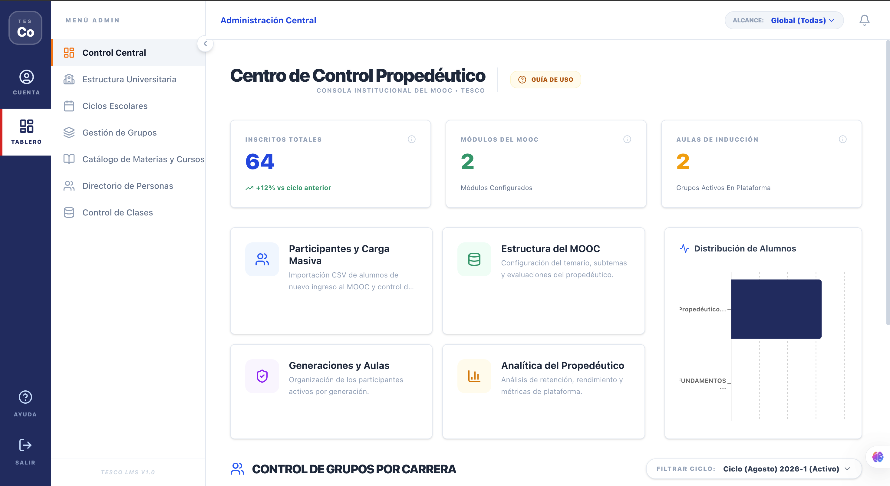
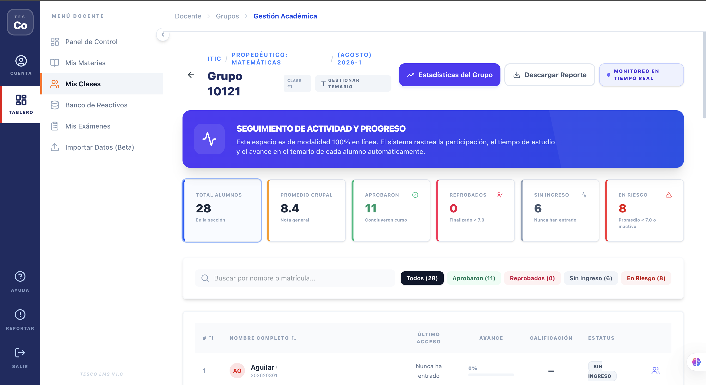

# Plataforma Web para Cursos Propedéuticos

> Sistema web integral de gestión académica diseñado para la nivelación en ciencias básicas de estudiantes de nuevo ingreso, soportando más de 100 usuarios concurrentes con métricas de rendimiento en tiempo real.

*(Nota: Por acuerdos de privacidad institucional, este repositorio actúa como documento de arquitectura. El código fuente completo es privado).*

## Arquitectura del Sistema

El proyecto está desarrollado mediante una arquitectura cliente-servidor separando las responsabilidades de interfaz y procesamiento de datos:
- **Frontend:** Next.js y React, servido mediante Apache.
- **Backend:** Servicios RESTful construidos en PHP puro.
- **Base de Datos:** MySQL (Relacional).
- **Comunicación:** Web Services que retornan estructuras JSON consumidas de forma asíncrona por el cliente web.

## Matriz de Roles y Flujos de Usuario

El sistema garantiza aislamiento de privilegios mediante tres roles independientes:

1. **Administrador (Gestión Maestra):**
   - Configuración de la infraestructura escolar (Ciclos, Carreras, Coordinadores, Materias, Temas).
   - Creación y auditoría de grupos, profesores y alumnos.
2. **Profesor (Gestión Académica):**
   - Creación de contenido dinámico (Módulos, Bancos de preguntas, Reactivos, Ejercicios).
   - Monitoreo de grupos mediante dashboards de porcentaje de avance y calificaciones.
   - Administración de candados lógicos (desbloqueo de exámenes según el progreso).
3. **Alumno (Consumo y Evaluación):**
   - Visualización de temarios, material audiovisual y recursos didácticos.
   - Ejecución de evaluaciones (Diagnósticas, Temáticas y Finales).
   - Visualización de estadísticas de progreso y generación automática de diploma de finalización.

## Impacto Técnico
Diseñado con optimización de consultas SQL y manejo de estados en React para evitar cuellos de botella en el servidor, garantizando alta disponibilidad durante las ventanas críticas de exámenes simultáneos.

## Escalabilidad
La plataforma cuenta con una lista sobre las áreas de los curos, permitiendo incluir programación, ciencias, administración, etc. Con la finalidad de no solo resolver problemas de una sola parte, sino en toda la institución y carreras.

----------------------------------------------------------------------------------------------------------------------------------------------

## Demostración Visual

**Pantalla principal / Vista de Inicio**

**Pantalla Login / Vista de Inicio de sesión (todos los roles tienen el mismo diseño)**

**Pantalla Administrador / Vista principal del Administrador y su menú de opciones**

**Pantalla Profesor / Vista principal del Profesor y su menú de opciones**

**Pantalla Profesor / Vista de estadísticas por grupo**

